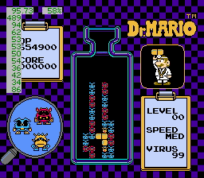

# Table of Contents

* Table of Contents
* What is it?
* Quick Start
* Miscellaneous
* Key-value files
    * Configuration file
    * Problem descriptions

# What is it?

Bo Krif Ulse are the three Words of Power for the great shout of speedrunning; they translate roughly to "move, strive, forever". They reflect the goals of this tool: to practice precise, fast pill movements in the endless struggle to improve at Dr. Mario.

I have found that there are a couple of pill movements that come up repeatedly while playing Dr. Mario. I wanted a way to experiment with these movements, with various goals:

1. Sometimes there are multiple sensible paths to getting a pill to a particular location. Which one is fastest? It is tough to experiment with this during a game, because you must choose one and go, so you cannot easily try different variations, and because there is little in-game feedback about how long a particular pill drop actually took, so you cannot judge the relative merit of different variations.
2. In other situations, there is just one sensible path, but it is precise. But each individual maneuver might only come up infrequently, making it difficult to practice that maneuver. It would be nice to be able to pick a single maneuver and practice it repeatedly, until it becomes smooth, automatic, and consistent.
3. I wanted to learn the timing of various extremely common moves -- such as moving to a particular column before dropping a pill -- with some control over how long I practice a particular timing before moving on to another.
4. In some situations, I know there are two ways to do a thing, but I don't know which one is riskier. I'd like to be able to try it many times and see some statistics about how often I made a mistake, so that I can make informed decisions during gameplay about which moves to attempt and which to avoid.

This script helps with these goals by letting you set up a Dr. Mario board however you like, and repeatedly giving you a particular pill to place on that board. Once it's placed, the board is reset to its original state and you may immediately practice it again. It also reports some statistics; for now, these are how many frames you took to place the pill, whether you hit the right location or not, your success rate, and the average frame count for successful placements. Here's a short teaser showing these features:

In the top left is the average successful frame count. Underneath the average, the frame counts for individual successes are listed. To the right is the fraction of attempts at which the pill locked in the right location, and below that (when appropriate) is the number of frames the last unsuccessful attempt took.

# Quick Start

1. Unzip [the latest release](http://dmwit.com/bokrifulse/00-bokrifulse-latest.zip) somewhere; I'll call the directory you chose DIR in the rest of these instructions.
2. Start [fceux](http://www.fceux.com/web/home.html) and load the Dr. Mario ROM.
3. Go to File &rarr; Load Lua Script, navigate to DIR, and choose bokrifulse.lua.
4. Start a 1 player game. I recommend choosing level 0, but the script will deal with it no matter what settings you choose.

# Miscellaneous

You may advance to the next problem either automatically by succeeding 15 times or manually by holding up while the pill locks.

# Key-value files

Bo Krif Ulse stores all of its configuration and runtime data in key-value files. These files are line-oriented; each line is either a comment (these start with `#`) or has a key and a value separated by an `=`. For example,

    # this is a comment

    dragons = cool

is a valid key-value file that associates the key `dragons` with the list of values [`cool`]; both the first line and the blank line following it count as comments and are ignored. Some values have to be in a specific format. A precise description of the syntax and special value formats follows.

Files are read in the latin-1 encoding because this is a lua script and I am lazy. A *whitespace character* is a tab, newline, vertical line feed, form feed, carriage return, or space (bytes 9, 10, 11, 12, 13, and 32). *Whitespace* is any sequence of whitespace characters (including the empty sequence). A *line break* is a newline, vertical line feed, form feed, or carriage return.

A *key* is any sequence of characters other than `=` or line breaks which does not start with `#` or a whitespace character and does not end with a whitespace character. A *value* is any sequence of characters other than line breaks which does not start or end with a whitespace character.

In this documentation, we use square brackets to enclose lists, and commas to separate values in the list. We use `monospace` for literal values and **bold** for metavariables standing in for a value; for example, [`foo`, **bar**] describes a list with two values in it, whose first value is exactly the string containing the characters `f`, `o`, and `o`, and whose second value can be referred to in surrounding text by the name **bar** but whose value we have not yet specified precisely.

The denotation of a key-value file is a total mapping from keys to lists of values. Each line of the file is expected to be in one of three formats:

1. Whitespace-only. These lines are ignored.
2. A comment, which is whitespace, followed by the character `#`, followed by any characters at all. These lines are ignored.
3. A key-value pair, which is whitespace, a key, whitespace, the character `=`, whitespace, a value, and whitespace. This adds the value to the list of values associated with the key.

Keys not mentioned in the file text are associated with [ ]. Multiple lines with the same key are allowed; the list of values associated with that key will be in the same order as they are in the file.

Below we will describe some *formats*, which assign special meanings to specific keys. For a particular format, a key may have a *default*, which is a value. If a key has default **d** in some format, then any key-value file whose denotation maps that key to [ ] will behave instead as if it maps that key to [**d**].

A *number* is a value in any format that lua's `tonumber` turns into a whole number. When giving bounds on these numbers, the bounds are inclusive. A *single number* is [**n**] where **n** is a number.

A *color character* is one of the characters `b`, `r`, `y`, `B`, `R`, or `Y`, with the following meaning:

| Character | Meaning |
|:---------:|:------- |
|`b`|blue|
|`B`|blue|
|`r`|red|
|`R`|red|
|`y`|yellow|
|`Y`|yellow|

## Configuration file

The top-level configuration must be stored in a file named `config` in the same directory as the `bokrifulse.lua` script itself. It is a key-value file, and gives the following keys special meaning:

* `version`: Must be [`1`].
* `problem`: The values in this list are treated as filenames. They should be relative paths, and will be interpreted as relative to the directory containing `bokrifulse.lua`. Each file referenced will be parsed as a problem file (see the subsection "Problem descriptions"); any invalid files will be skipped. If every file gets skipped, a special hard-coded problem will be used instead. The resulting non-empty list of problems will be cycled through one at a time; when the player succeeds 15 times, the script will advance to the next one.

There are a handful of different example configurations provided with the script that focus on different aspects of Dr. Mario play. You can use them by deleting the provided `config`, copying one of the other example configurations, then renaming it to `config`. You may always return to the default by performing this process with `config.default`.

## Problem descriptions

Individual problems describe the board position for the script to create, which pill should be presented to the user, and what target locations constitute a success. They are described in key-value files, and give the following keys special meaning:

* `version`: Must be [`1`].
* `row`: Must be a list containing exactly 16 values. The interpretation of these values is described below.
* `pill`: This specifies which pill Dr. Mario will throw into the bottle for the player. It must be [**pill**] and **pill** must be two color characters. The first color character describes the left half of the pill, and the second color character the right half.
* `goal x`: A single number between 0 and 7. The player must lock the pill with its bottom-left corner at this x position to be considered successful. 0 is the left-most column; 7 the right-most.
* `goal y`: A single number between 0 and 15. The player must lock the pill with its bottom-left corner at this y position to be considered successful. 0 is the bottom row; 15 the top.
* `goal orientations`: A non-empty list of numbers between 0 and 3. The player must lock the pill in one of the orientations in this list to be considered successful. The number describes how many counterclockwise rotations are needed to get from the initial pill that Dr. Mario threw to the desired orientation.
* `speed`: A single number between 0 and 49; default 0. The game will behave as if enough pills have dropped since the start of the level to increase the speed this many times.
* `viruses`: A single number between 1 and 99; default 99. This one is just for fun; it sets the virus count in the lower right of the screen to the given number.

The values for the `row` key are pictorial representations of the contents of the board that the player will be presented with. They use `--` for empty space, and a pair of characters describing the color and shape of a cell for the occupied spaces. For example, the string

    --rxrxbo--y<r>----

describes a row that has an empty space, two red viruses, a blue pill half, an empty space, a yellow and red pill, and two more empty spaces. The precise format description follows.

A *shape character* is one of the characters `x`, `o`, `<`, `>`, `V`, `v`, or `^`, with the following meaning:

| Character | Meaning |
|:---------:|:------- |
|`x`|virus|
|`o`|disconnected pill half|
|`<`|left half of a horizontal pill|
|`>`|right half of a horizontal pill|
|`V`|bottom half of a vertical pill|
|`v`|bottom half of a vertical pill|
|`^`|top half of a vertical pill|

A *cell* is two characters in one of the following forms:

* The exact string `--`. This indicates an unoccupied space on the playfield.
* A color character followed by a shape character. This indicates an occupied space of the given color and shape.
* Two hex digits (`0` through `9`, `a` through `f`, or `A` through `F`). The resulting byte will be used to index into Dr. Mario's sprite table.

A *playfield row* is a value containing exactly 8 cells separated by whitespace. The first cell describes the left-most column, the last the right-most column.

A *playfield* is a list of 16 playfield rows; the first playfield row describes the top of the screen, the last playfield row describes the bottom.

The `row` key must be associated with a playfield.
